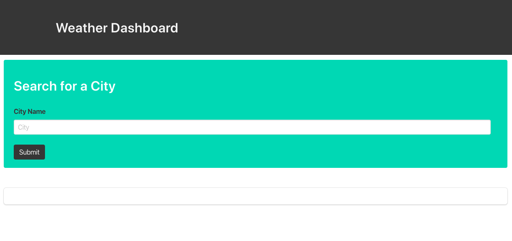
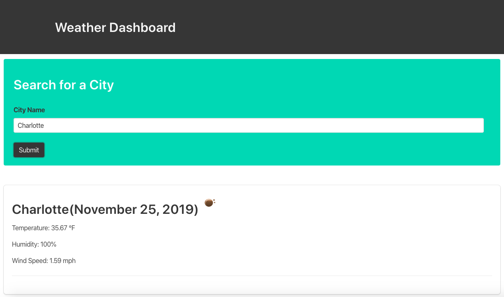
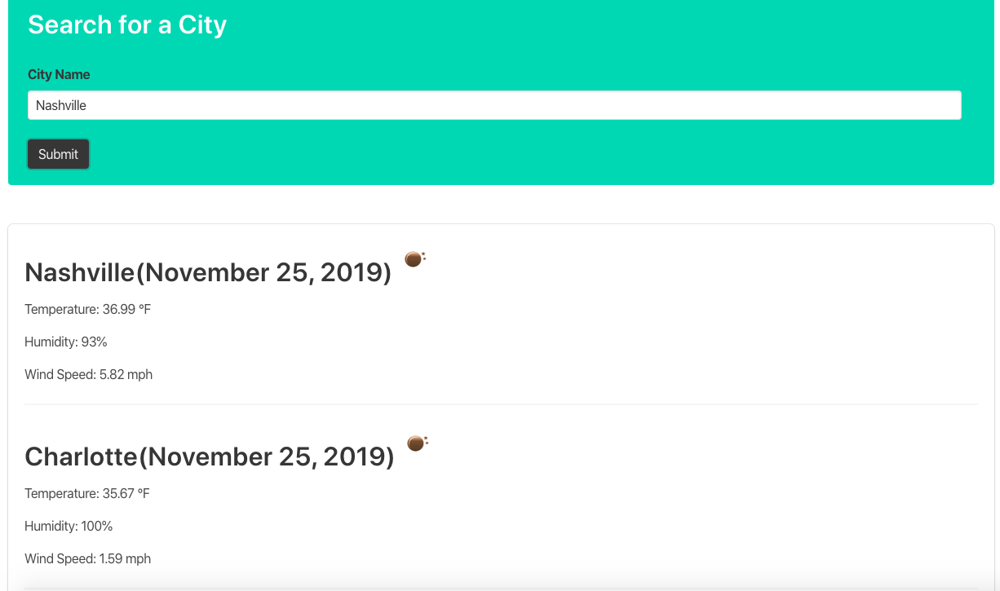

### Weather Application

## Installation

No installation is necessary

## Purpose
The purpose of this page is to allow the user to access weather updates in real time for any US city. 

## Functionality
The page will allow users to enter any any US city and pull current weather data, including location, date, weather icon, temperature in fahrenheit, humidity and wind speed 

## Contributing
TA's, Students, W3School, Github
Pull requests are welcome. For major changes, please open an issue first to discuss what you would like to change.

Please make sure to update tests as appropriate.

## Links

Page URL: https://cmarshman.github.io/weather/index.html

Github Repo: https://github.com/cmarshman/weather

## Images

Page Opening +++++++++++++++++++++++++++++++++++++++

First City +++++++++++++++++++++++++++++++++++++++++

Second City ++++++++++++++++++++++++++++++++++++++++

Favicon +++++++++++++++++++++++++++++++++++++++++++++++++++++++++++++++++++

## License
MIT License

Copyright (c) [2019] [Cory Marshman]

Permission is hereby granted, free of charge, to any person obtaining a copy
of this software and associated documentation files (the "Software"), to deal
in the Software without restriction, including without limitation the rights
to use, copy, modify, merge, publish, distribute, sublicense, and/or sell
copies of the Software, and to permit persons to whom the Software is
furnished to do so, subject to the following conditions:

The above copyright notice and this permission notice shall be included in all
copies or substantial portions of the Software.

THE SOFTWARE IS PROVIDED "AS IS", WITHOUT WARRANTY OF ANY KIND, EXPRESS OR
IMPLIED, INCLUDING BUT NOT LIMITED TO THE WARRANTIES OF MERCHANTABILITY,
FITNESS FOR A PARTICULAR PURPOSE AND NONINFRINGEMENT. IN NO EVENT SHALL THE
AUTHORS OR COPYRIGHT HOLDERS BE LIABLE FOR ANY CLAIM, DAMAGES OR OTHER
LIABILITY, WHETHER IN AN ACTION OF CONTRACT, TORT OR OTHERWISE, ARISING FROM,
OUT OF OR IN CONNECTION WITH THE SOFTWARE OR THE USE OR OTHER DEALINGS IN THE
SOFTWARE.